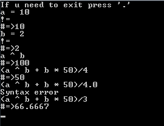

# Simple Parser In C++
## Supported operators (sorted in descending order of calculation priority)

()            | change priority  
!, -, +       | unary 
^             | exponentiation 
*, /, %       | multiply, division, remainder 
+, -          | addition, subtracting 
\>, >=, <, <= | logical expressions 
==, !=        | equal, unequal 
&&            | and 
||            | or 
=, +=, -=, %= | assignment 
\*=, /=, ^=   | ^^ 
 

